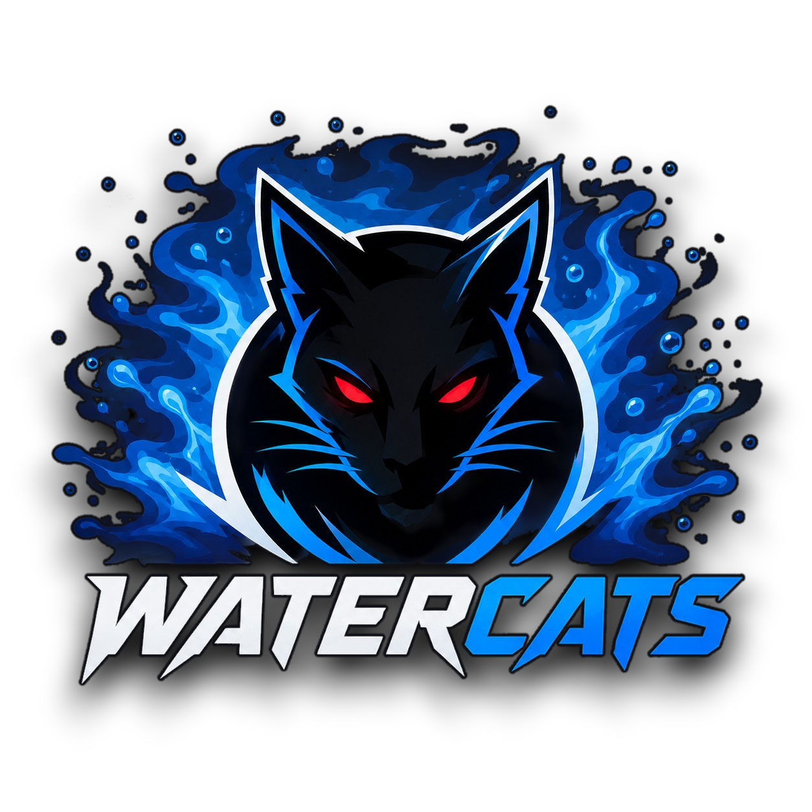

<p align="center">
  
</p>

<h1 align="center">WATERCATS</h1>

<p align="center">
  Jogadores antigos. O mesmo jogo.<br>
  Site do clube — elenco, estatísticas e jogadas pela <a href="https://allstar.gg">allstar.gg</a>.
</p>

<p align="center">
  <a href="https://watercats.vercel.app"><strong>watercats.vercel.app</strong></a>
  ·
  <a href="https://discord.gg/et6N2Y3pJj">Discord</a>
  ·
  <a href="https://steamcommunity.com/groups/watercatsgg">Steam</a>
</p>

---

## O que é

Site estático com API na Vercel e dados no Supabase. O público vê o elenco, as estatísticas e os clipes. Quem tem a senha entra em `/login` e edita tudo pelo painel.

Não inventa biografia nem número: o que não foi cadastrado aparece vazio.

## Tecnologias

| Camada | Tecnologia |
| --- | --- |
| Front-end | HTML, CSS e JavaScript (sem framework) |
| Hospedagem | [Vercel](https://vercel.com) (projeto `watercats`) |
| API | Funções da Vercel em `api/` |
| Banco | Supabase (Postgres) |
| Clipe | embed `https://allstar.gg/iframe?clip=ID` |

## Páginas

| Rota | Arquivo | Função |
| --- | --- | --- |
| `/` | `index.html` | Início: logo, elenco, números e jogadas em destaque |
| `/players` | `players.html` | Lista do elenco |
| `/jogador/:slug` | `player.html` | Perfil (rewrite no `vercel.json`) |
| `/stats` | `stats.html` | Tabela de estatísticas |
| `/clips` | `clips.html` | Jogadas da allstar.gg |
| `/login` | `login.html` | Entrada do painel |
| `/admin` | `admin.html` | Edição de jogadores, estatísticas e clipes |

## Estrutura

```
watercats/
├── api/                 rotas da API no servidor
├── css/                 estilo do site
├── img/                 marca
├── js/                  scripts do navegador
├── lib/                 helpers da API (só no servidor)
├── scripts/             migração do banco
├── *.html               páginas públicas e painel
├── supabase.sql         schema do banco
├── vercel.json          rotas da Vercel
├── package.json         dependência da migração
└── .env.example         nomes das variáveis, sem segredo
```

### Páginas

| Arquivo | Descrição |
| --- | --- |
| `index.html` | Página inicial. |
| `players.html` | Grade do elenco. |
| `player.html` | Ficha do jogador, estatísticas e clipes. |
| `stats.html` | Tabela de estatísticas. |
| `clips.html` | Lista de jogadas. |
| `login.html` | Formulário de senha. |
| `admin.html` | Painel: abas Jogadores, Estatísticas e Clipes. |

### Front-end

| Arquivo | Descrição |
| --- | --- |
| `css/app.css` | Layout, menu, temas claro/escuro e paleta da marca. |
| `js/site.js` | Cabeçalho, rodapé, idioma, tema e chamadas públicas. |
| `js/admin.js` | Sessão do painel; criação, edição e exclusão. |

### Marca

| Arquivo | Descrição |
| --- | --- |
| `img/logo.png` | Logo completa com fundo transparente; também é o ícone da aba. |
| `img/icon.png` | Recorte do gato (marca quadrada). |
| `img/favicon.png` | Ícone 64×64 gerado da logo. |

### API (`api/`)

Toda alteração exige token (`x-admin-token`) depois do login, ou o PIN em `x-edit-pin`.

| Arquivo | Método | Descrição |
| --- | --- | --- |
| `api/auth.js` | `POST` | Valida a senha (`EDIT_PIN`) e devolve token de 12h. |
| `api/players.js` | `GET` `PUT` `DELETE` | Lista / ficha / salva / apaga jogador. |
| `api/stats.js` | `PUT` | Atualiza estatísticas de um jogador. |
| `api/clips.js` | `GET` `PUT` `DELETE` | Clipes; o link precisa ser da allstar.gg. |
| `api/photo.js` | `POST` | Envio de foto (JPG, PNG, WEBP, GIF, até 1,5 MB). |

### Servidor (`lib/` e `scripts/`)

| Arquivo | Descrição |
| --- | --- |
| `lib/cloud.js` | Acesso ao Supabase, sessão, leitura do clipe e gravação. A chave de serviço fica só aqui. |
| `lib/http.js` | Leitura do corpo da requisição e respostas JSON. |
| `scripts/migrate.js` | Aplica `supabase.sql` no Postgres. |
| `supabase.sql` | Tabelas `players`, `player_stats` e `clips`. Não mexe em `org_*`. |
| `vercel.json` | URLs sem `.html` e rewrite `/jogador/:slug` → `player.html`. |
| `package.json` | Script `migrate` e cliente `postgres`. |
| `.env.example` | Nomes das variáveis de ambiente. |
| `.gitignore` | Ignora `.env*`, `node_modules` e `.vercel`. |
| `LICENSE` | Licença MIT. |

A chave `SUPABASE_SERVICE_ROLE_KEY` nunca vai para o navegador.

## Banco

Três tabelas no schema `public`:

- **`players`** — ficha (nick, nome, função, país, Steam, FACEIT, Discord, Twitch, bio, foto, status).
- **`player_stats`** — rating, K/D, ADR, HS%, mapas, vitórias/derrotas, kills, clutches, MVP.
- **`clips`** — título, URL da allstar.gg, mapa, destaque, jogador.

Estatísticas vazias aparecem como "—" no site.

O mesmo projeto Supabase pode ter tabelas `org_*` da [watercatsgg](https://github.com/khastz95/watercatsgg). A migração deste repositório **não** as apaga.

## Ambiente

Copie `.env.example` para `.env.local` (local) e defina o mesmo na Vercel (Production / Preview / Development):

```
SUPABASE_URL=
SUPABASE_SERVICE_ROLE_KEY=
EDIT_PIN=
POSTGRES_URL_NON_POOLING=
```

`EDIT_PIN` é a senha de `/login`. `POSTGRES_URL_NON_POOLING` só é preciso para a migração.

```bash
npm install
npm run migrate
npx vercel --prod
```

O GitHub `khastz95/watercats` já está ligado ao projeto Vercel **watercats**. Push em `main` dispara o deploy.

## Paleta

Preto `#000000` / fundo `#0b1220`, azul-escuro `#001428`, azul `#006BFF`, elétrico `#008CFF`, ciano `#20B8FF`, branco, cinza `#8A8A8A`. Vermelho `#FF1838` só como detalhe (olhos da logo). O site tem tema claro e escuro.

## Licença

[MIT](LICENSE)
