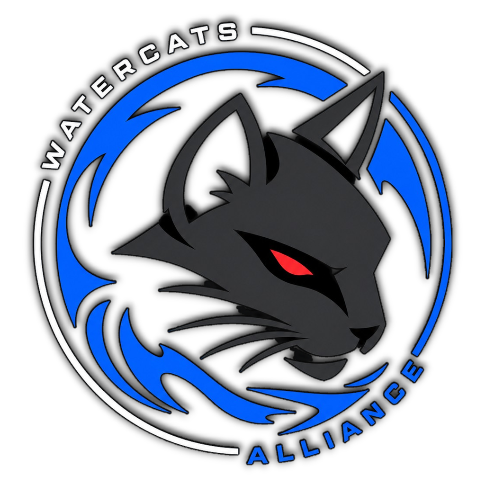

<p align="center">
  <picture>
    <source media="(prefers-color-scheme: dark)" srcset="img/logo-dark.png">
    
  </picture>
</p>

<h1 align="center">WATERCATS</h1>

<p align="center">
  OLD FRIENDS. SAME GAMES.<br>
  Um clube de amigos. Membros, números e jogadas.
</p>

<p align="center">
  <a href="https://watercats.vercel.app"><strong>watercats.vercel.app</strong></a>
</p>

---

## O que é

Site estático com API na Vercel e dados no Supabase. O público vê o clube, os membros, os números da temporada e as jogadas. Quem tem a senha entra em `/login` e cuida do arquivo pelo painel.

Não inventa biografia nem número: o que não foi cadastrado aparece vazio.

## Tecnologias

| Camada | Tecnologia |
| --- | --- |
| Front-end | HTML, CSS e JavaScript (sem framework) |
| Hospedagem | [Vercel](https://vercel.com) (projeto `watercats`) |
| API | Funções da Vercel em `api/` |
| Banco | Supabase (Postgres) |
| Clipe | embed `https://allstar.gg/iframe?clip=ID` |

## Páginas

| Rota | Arquivo | Função |
| --- | --- | --- |
| `/` | `index.html` | Início: o clube, os membros, os números e as jogadas |
| `/players` | `players.html` | Membros atuais |
| `/jogador/:slug` | `player.html` | Perfil (rewrite no `vercel.json`) |
| `/stats` | `stats.html` | Números da temporada |
| `/clips` | `clips.html` | Arquivo de jogadas |
| `/sobre` | `sobre.html` | O clube |
| `/login` | `login.html` | Entrada do painel |
| `/admin` | `admin.html` | Edição de jogadores, estatísticas e clipes |

## Estrutura

```
watercats/
├── api/                 rotas da API no servidor
├── css/                 estilo do site
├── img/                 marca
├── js/                  scripts do navegador
├── lib/                 helpers da API (só no servidor)
├── scripts/             migração do banco
├── *.html               páginas públicas e painel
├── supabase.sql         schema do banco
├── vercel.json          rotas da Vercel
├── package.json         dependência da migração
└── .env.example         nomes das variáveis, sem segredo
```

### Páginas

| Arquivo | Descrição |
| --- | --- |
| `index.html` | Página inicial. |
| `players.html` | Grade do elenco. |
| `player.html` | Ficha do jogador, estatísticas e clipes. |
| `stats.html` | Tabela de estatísticas. |
| `clips.html` | Lista de jogadas. |
| `login.html` | Formulário de senha. |
| `admin.html` | Painel: abas Jogadores, Estatísticas e Clipes. |

### Front-end

| Arquivo | Descrição |
| --- | --- |
| `css/app.css` | Layout, menu, temas claro/escuro e paleta da marca. |
| `js/site.js` | Cabeçalho, rodapé, idioma, tema e chamadas públicas. |
| `js/admin.js` | Sessão do painel; criação, edição e exclusão. |

### Marca

| Arquivo | Descrição |
| --- | --- |
| `img/logo-dark.png` | Logo completa (gato + texto) para fundo escuro. |
| `img/logo-light.png` | Logo completa para fundo claro. |
| `img/icon-dark.png` | Só o gato — menu e ícone da aba no tema escuro. |
| `img/icon-light.png` | Só o gato — menu e ícone da aba no tema claro. |

### API (`api/`)

Toda alteração exige token (`x-admin-token`) depois do login, ou o PIN em `x-edit-pin`.

| Arquivo | Método | Descrição |
| --- | --- | --- |
| `api/auth.js` | `POST` | Valida a senha (`EDIT_PIN`) e devolve token de 12h. |
| `api/players.js` | `GET` `PUT` `DELETE` | Lista / ficha / salva / apaga jogador. |
| `api/stats.js` | `PUT` | Atualiza estatísticas de um jogador. |
| `api/clips.js` | `GET` `PUT` `DELETE` | Clipes; o link precisa ser da allstar.gg. |
| `api/photo.js` | `POST` | Envio de foto (JPG, PNG, WEBP, GIF, até 1,5 MB). |
| `api/leetify.js` | `GET` `POST` | Lê o que já veio da Leetify; o `POST` sincroniza os jogadores com SteamID64. |
| `api/steam.js` | `POST` | Busca o avatar do perfil da Steam de cada jogador com SteamID64. |
| `api/allstar.js` | `POST` | Busca os clipes públicos da allstar.gg de cada jogador com SteamID64. |

### Servidor (`lib/` e `scripts/`)

| Arquivo | Descrição |
| --- | --- |
| `lib/cloud.js` | Acesso ao Supabase, sessão, leitura do clipe e gravação. A chave de serviço fica só aqui. |
| `lib/leetify.js` | Chamada à API pública da Leetify e leitura da resposta. |
| `lib/steam.js` | Lê o avatar no XML público do perfil da Steam. |
| `lib/allstar.js` | Resolve o SteamID64 na allstar.gg e lista os clipes. |
| `lib/http.js` | Leitura do corpo da requisição e respostas JSON. |
| `scripts/db.js` | Carrega o `.env.local` e abre a conexão com o Postgres. |
| `scripts/migrate.js` | Aplica `supabase.sql` no Postgres. |
| `scripts/seed-roster.js` | Grava os dados públicos dos 5 perfis da Steam. |
| `scripts/steam-avatars.js` | Busca os avatares da Steam pela linha de comando (`npm run avatars`). |
| `scripts/allstar-clips.js` | Busca os clipes da allstar.gg pela linha de comando (`npm run clips`). |
| `supabase.sql` | Tabelas `players`, `player_stats` e `clips`. Não mexe em `org_*`. |
| `vercel.json` | URLs sem `.html` e rewrite `/jogador/:slug` → `player.html`. |
| `package.json` | Scripts `migrate` e `seed`, e o cliente `postgres`. |
| `.env.example` | Nomes das variáveis de ambiente. |
| `.gitignore` | Ignora `.env*`, `node_modules` e `.vercel`. |
| `LICENSE` | Licença MIT. |

A chave `SUPABASE_SERVICE_ROLE_KEY` nunca vai para o navegador.

## Banco

Três tabelas no schema `public`:

- **`players`** — ficha (nick, nome, função, país, Steam, FACEIT, Discord, Twitch, bio, foto, avatar da Steam, status).
- **`player_stats`** — rating, K/D, ADR, HS%, mapas, vitórias/derrotas, kills, clutches, MVP.
- **`clips`** — título, URL da allstar.gg, mapa, arma, views, duração, thumbnail, origem (`manual` ou `allstar`), destaque, jogador.

Estatísticas vazias aparecem como "—" no site.

## Leetify

Os números vêm da [API pública da Leetify](https://api-public-docs.cs-prod.leetify.com). Não precisa de chave: `LEETIFY_API_KEY` é opcional e só afrouxa o limite de requisições ([pega em leetify.com/app/developer](https://leetify.com/app/developer)).

O painel tem o botão **Sincronizar Leetify** na aba Estatísticas. Ele chama `GET /v3/profile?steam64_id=…` para cada jogador e guarda o resultado em `player_stats.extra.leetify`, sem tocar no que foi preenchido à mão.

O perfil é guardado inteiro. O que a Leetify devolve e o site mostra:

| Bloco | Vem de | Campos |
| --- | --- | --- |
| Ranks | `ranks` | Rating Leetify, Premier, Wingman, Renown, nível e Elo FACEIT |
| Rank por mapa | `ranks.competitive` | um por mapa (mapa sem rank é omitido) |
| Notas de habilidade | `rating` | mira, posicionamento, utilitária, clutch, entrada, lado CT, lado TR |
| Mira | `stats` | precisão com inimigo à vista, tiros na cabeça, rajada, counter-strafe, pré-mira, reação |
| Utilitária | `stats` | flashes jogadas, inimigos e aliados cegos por flash, tempo cegando, flash que virou abate, dano de HE em inimigos e aliados, utilitária perdida na morte |
| Trocas e entrada | `stats` | chances de troca por round, trocas concluídas, mortes vingadas, primeiro duelo e agressão na entrada (CT e TR) |
| Últimas partidas | `recent_matches` | 20 partidas com mapa, placar, resultado, rating, tiros na cabeça, pré-mira e reação |
| Joga com | `recent_teammates` | quem aparece nas partidas recentes, ligado ao elenco quando é da casa |

São 21 métricas de `stats`, todas as 7 notas de `rating` e os 6 ranks. As listagens (home, elenco, tabela) recebem só um resumo de ~500 bytes; a ficha do jogador recebe o perfil completo.

**K/D e ADR a Leetify não devolve** — esses continuam saindo do painel. O perfil só responde para quem tem conta na Leetify com o perfil público; os cinco do elenco estão públicos.

Os SteamID64 do elenco:

| Jogador | SteamID64 | Perfil |
| --- | --- | --- |
| s4mz | 76561198304687498 | [MORFETlCO](https://steamcommunity.com/id/MORFETlCO) |
| fury | 76561198330330644 | [furyntc](https://steamcommunity.com/id/furyntc) |
| bill | 76561198340052875 | [BILZERA](https://steamcommunity.com/profiles/76561198340052875) |
| khastz | 76561198069381773 | [khastz95](https://steamcommunity.com/id/khastz95) |
| cadu | 76561199173505462 | [Cadu](https://steamcommunity.com/profiles/76561199173505462) |

## Foto do jogador

Duas origens, nesta ordem:

1. **Foto enviada no painel** — vai para o bucket `player-photos` e fica em `players.photo_url`.
2. **Avatar da Steam** — o botão **Buscar avatares da Steam**, na aba Jogadores, lê o XML público do perfil (`/profiles/<id>/?xml=1`, sem chave de API) e guarda a URL do CDN em `players.steam_avatar`. O mesmo dá pelo terminal com `npm run avatars`.

São colunas separadas de propósito: buscar os avatares de novo não apaga foto enviada à mão, e apagar a foto enviada faz o site voltar para o avatar. Sem nenhuma das duas, aparece o bloco na cor do jogador.

O maior tamanho que a Steam devolve é **184×184** (`_full.jpg`), então nos cards grandes a imagem fica um pouco macia. Para ficar nítido, é preciso enviar a foto pelo painel.

## Clipes da allstar.gg

O botão **Buscar clipes da allstar.gg**, na aba Clipes, resolve o SteamID64 na GraphQL pública da allstar (`playerSearch` + `clipsNew`) e grava cada vídeo pelo `clip_id`. O mesmo dá pelo terminal com `npm run clips`.

O que entra no banco por clipe: título, URL `https://allstar.gg/clip?clip=…`, thumbnail, mapa, arma, abates, views, duração e data. O player do site usa o iframe oficial; a grade mostra a thumbnail e só carrega o vídeo quando alguém clica em play.

A sincronização **não apaga** clipes colados à mão e **não desmarca** destaque. Se o mesmo `clip_id` já existir, só atualiza título, mapa e números.

Os cinco do elenco têm conta pública na allstar.gg.

O mesmo projeto Supabase pode ter tabelas `org_*` da [watercatsgg](https://github.com/khastz95/watercatsgg). A migração deste repositório **não** as apaga.

## Ambiente

Copie `.env.example` para `.env.local` (local) e defina o mesmo na Vercel (Production / Preview / Development):

```
SUPABASE_URL=
SUPABASE_SERVICE_ROLE_KEY=
EDIT_PIN=
POSTGRES_URL_NON_POOLING=
```

`EDIT_PIN` é a senha de `/login`. `POSTGRES_URL_NON_POOLING` só é preciso para a migração.

```bash
npm install
npm run migrate
npm run seed
npm run avatars
npm run clips
npx vercel --prod
```

O GitHub `khastz95/watercats` já está ligado ao projeto Vercel **watercats**. Push em `main` dispara o deploy.

## Paleta

Preto `#000000` / fundo `#0b1220`, azul-escuro `#001428`, azul `#006BFF`, elétrico `#008CFF`, ciano `#20B8FF`, branco, cinza `#8A8A8A`. Vermelho `#FF1838` só como detalhe (olhos da logo). O site tem tema claro e escuro.

## Licença

[MIT](LICENSE)
